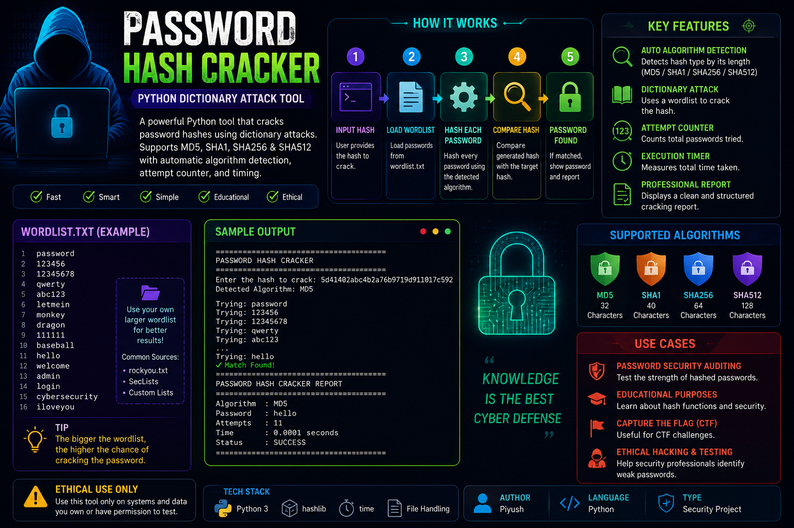
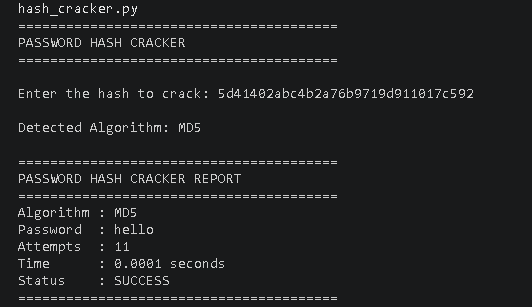

# 🔐 Password Hash Cracker

A Python-based Password Hash Cracker that demonstrates dictionary attacks against hashed passwords. The tool automatically detects the hashing algorithm and attempts to recover the original password using a wordlist.

---

## 📊 Project Overview

---

## 🎯 Features

* Automatic hash algorithm detection
* Supports MD5, SHA1, SHA256, and SHA512
* Dictionary attack using external wordlist
* Password recovery reporting
* Attempt counter
* Execution time measurement
* Professional output report

---

## 🛠 Technologies Used

* Python
* hashlib
* time
* File Handling

---

## ⚙️ How It Works

1. User enters a target hash.
2. Program detects the hashing algorithm based on hash length.
3. Passwords are loaded from `wordlist.txt`.
4. Each password is hashed using the detected algorithm.
5. Generated hashes are compared against the target hash.
6. If a match is found, the password is recovered and reported.

---

## 🖥 Sample Output

---

## 📂 Project Structure

Password-Hash-Cracker/

├── hash_cracker.py

├── wordlist.txt

├── README.md

└── screenshots/

  ├── password_hash_cracker_overview.png

  └── output.png

---

## 📚 Skills Learned

* Cryptographic Hash Functions
* MD5, SHA1, SHA256, SHA512
* Dictionary Attack Methodology
* Password Security Concepts
* Python File Handling
* Execution Time Measurement
* Cybersecurity Fundamentals

---

## ⚠️ Disclaimer

This project was developed for educational and cybersecurity learning purposes only. Use only on systems and data you own or have permission to test.

---

## 👨‍💻 Author

**Piyush Vishwakarma**

MCA (Cybersecurity) Student

Aspiring SOC Analyst | Digital Forensics Learner | Cybersecurity Enthusiast
